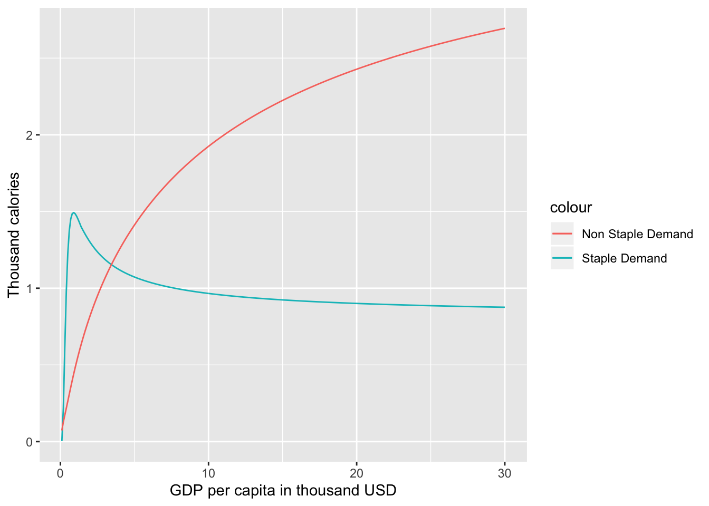

  [](https://codecov.io/gh/JGCRI/ambrosia)
[](https://zenodo.org/badge/latestdoi/69679416)


# `ambrosia`: An R package for calculating and analyzing food demand and in accordance with the Edmonds et al. food demand model

## Summary
The `ambrosia` R package was developed to calculate food demand for staples and non-staple commodities that is responsive to changing levels of incomes and prices. Ambrosia implements the framework to quantify food demand as established by Edmonds et al. (2017) and allows the user to explore and estimate different variables related to the food demand system. Currently `ambrosia` provides three main functions:
1. calculation of food demand for any given set of parameters including income levels and prices,
2. estimation of parameters within a given a dataset.  Note:  `ambrosia` is used to calculate parameters for the food demand model implemented in the Global Change Analysis Model (GCAM; Calvin et al. 2019)
3. exploration and preparation of raw data before starting a parameter estimation.


## Getting Started with `ambrosia`

`ambrosia` can be directly installed from its GitHub repository using the R `devtools` package. From an R prompt, run the command,

```r
devtools::install_github('JGCRI/ambrosia')

```

## Examples

A list of examples describing the different features in `ambrosia`are described in the [`ambrosia_vignette.rmd`](https://jgcri.github.io/ambrosia/articles/ambrosia_vignette.html) in the vignettes(`vignettes/`) directory. The example below shows how a user can get an estimate of demand using some sample parameters.

```r
#Get a sample data set
Test_Data <- data.frame(Y=seq(0.1,30, by=0.1))

#Add sample values of Ps and Pn
Test_Data %>% mutate(Ps=0.1,Pn=0.2) -> Test_Data

#Add some sample parameters
sample_parameters <- c(1.28,1.14,-0.19,0.21,-0.33,0.5,0.1,16,5.06,100,20)

#Now calculate food demand
Food_Demand <- food.dmnd(Test_Data$Ps,Test_Data$Pn,Test_Data$Y,params=vec2param(sample_parameters))

```
The code from the example can be used to visualize the food demand for staples and non-staples as follows,



## Contributing to `ambrosia`
We welcome contributions to `ambrosia` from the development community. Please contact us if you want to collaborate! The `ambrosia` GitHub repository is accessible here: [GitHub Repository](https://github.com/JGCRI/ambrosia)

# Availability

## Operating system
Mac OS X; Linux; Windows 10

## Programming language
R (>= 3.5.0)

## Dependencies
dplyr (>= 0.7)

nleqslv (>= 3.2)

reshape2 (>= 1.4.3)

ggplot2 (>= 2.2.1)

cluster (>= 2.0)

tidyr  (>= 0.7.1)

## Code repository

Name- GitHub; `JGCRI/ambrosia`

Identifier- https://github.com/JGCRI/ambrosia/tree/v1.3.0

License- BSD 2-Clause
