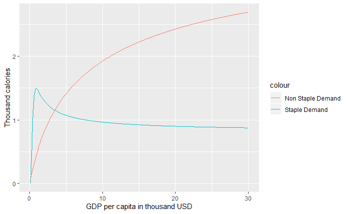
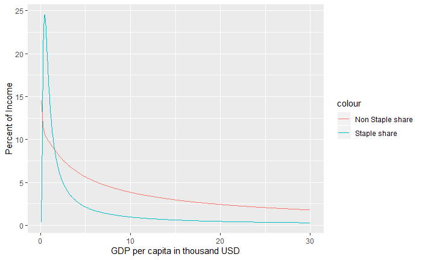
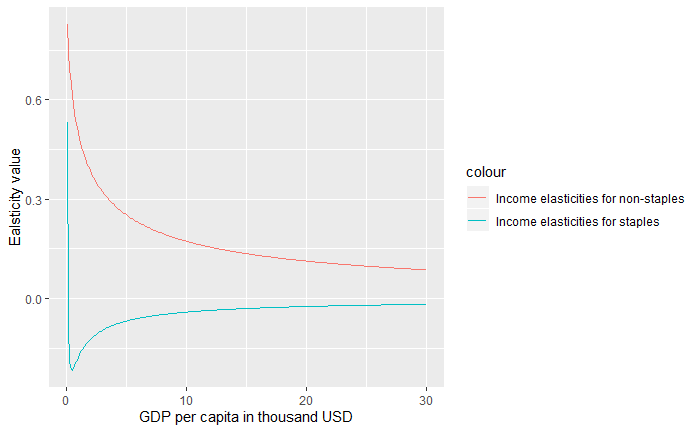
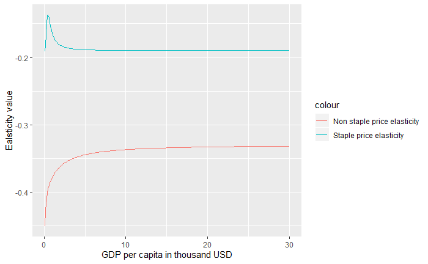
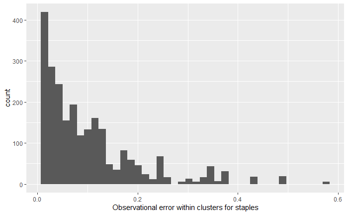

# Summary
The `ambrosia` R package was developed to calculate food demand for staples and non-staple commodities that is responsive to changing levels of incomes and prices. `ambrosia` implements the framework to quantify food demand as established by @edmonds2017global and allows the user to explore and estimate different variables related to the food demand system. Currently `ambrosia` provides three main functions:

(1)	calculation of food demand for any given set of parameters including income levels and prices;

(2)	estimation of parameters within a given a dataset.  Note:  `ambrosia` is used to calculate parameters for the food demand model implemented in the Global Change Analysis Model [GCAM; @calvin2019gcam];

(3)	exploration and preparation of raw data before starting a parameter estimation.

# Statement of need
An important motivation to develop `ambrosia` is functionalizing and separating out the different components of the sophisticated food demand framework described in  into usable R functions that can be easily parameterized and customized by the user. Thus, in addition to providing scientifically sound parameters for GCAM, `ambrosia` has been developed to help researchers explore questions related to trends in food demand empirically. Since the equations of the model are grounded in peer reviewed research while the code itself is written in R (which increases usability), the tool is useful to researchers interested in,

1)	analyzing and exploring trends in food demand with a computational model that is responsive to changes in incomes and prices that can easily be implemented on any time series (dataset);
2)  re-estimating parameters of the food demand model using custom data;
3)	incorporating a detailed food demand model in their own earth system and economic models.

`ambrosia` is part of an ecosystem of tools within the Global Change Intersectoral Modeling System (GCIMS) that help users computationally explore science and policy questions related to different dimensions of human-Earth systems [@pnnl_2020]. The parameters calculated from `ambrosia` are utilized directly in GCAM [@calvin2019gcam] to represent forecasts of food demand. `ambrosia` ensures that the parameters that are used within GCAM are scientifically and empirically sound and also ensures reproducibility of the parameters for validation to comply with the commitment of GCIMS to FAIR guiding principles for scientific data management [@wilkinson2016fair]. The code is structured to ensure that the parameters can be updated and tested effectively with changes in underlying data.    

Thus, the model not only enables easy use and future development, but also enables easy modularization of the code within other systems. The sections below contain a detailed discussion of the different functions and customization options available within the tool.

# Summary of the Edmonds et al. framework
The @edmonds2017global model represents a food demand model for staples and non-staple commodities at different levels of prices and incomes. Demand for staples is described as increasing when income is lower, eventually peaks at under 1000$ per person per capita,  and then begins to decline as higher income ranges are approached. Demand for non-staples increases with income over all income ranges; however, total (staple + non-staple) demand saturates at high income level.

The @edmonds2017global approach uses an 11 parameter model where the parameters are fit using pooled cross-sectional-timeseries observations and a Bayesian Markov Chain Monte Carlo method [MCMC; @hastings1970]. The framework represents demand for three categories of goods staples (s), non-staples (n) and materials (m) where materials represent everything in the economy other than staples and non-staple food commodities. The demand for these three categories changes with changes in income (Y) and prices (P), with the response to price changes varying with income. Expenditures on these three goods are assumed to exhaust income.  

Demand for these three categories can be represented mathematically as,

(1) Staple demand: $q_{s} = A_{s}(x^{h_{s}(x)})(w_{s}^{e_{ss(x)}})(w_{n}^{e_sn(x)})$

(2) Non-staple food demand: $q_{n} = A_{n}(x^{h_{n}(x)})(w_{s}^{e_{ns(x)}})(w_{n}^{e_nn(x)})$

(3) Materials demand : $q_{m} = x - w_{s}q_{s} - w_{n}q_{n}$

where $w_{i}$ is $P_{i}/P_{m}$, $x$ is $Y/P_{m}$ and $A_{i}$ are constants.

$e_{ij}$ is defined in a general way,

(4) $e_{ij}(x)=g_{ij}*f_{i}(x){\alpha}_{j}$

where $g_{i,j}$ are constants, $i >= j$ and $f_{i}(x) = ({\delta}ln(x^{h_{i}(x)}))/({\delta}ln(x))$.

If $h$ and $e$ were constants, $h$ would be an income elasticity as $x= Y/P_{m}$ and $e_{ij}$ would be own and cross price elasticity as $w_{i}= P_{i}/P_{m}$.

The following functional forms are chosen for $h_{s}$ and $h_{n}$,

(5) $h_{s}(x) = ({\lambda}/x)(1+({\kappa}/ln(x)))$

(6) $h_{n}(x) = {\nu}/(1-x)$.

In addition to the above, two other scaling parameters are applied when normalizing the demand values to that of materials. These are $psscl$ for staples and $pnscl$ for non-staples.

The table in appendix I summarizes all of the parameters described above.

The parameters are fit using a weighted least square log likelihood function [@carrol1988] described below.

(7) $ln(L) = {\Sigma}_{i=1}^{N}(w_{i}(y_{i}-\hat{y_{i}})^{2})/2{\sigma^{2}}$

where, $y_{i}$ is the $i$th data value and $\hat{y_{i}}$ is the corresponding model output and $w_{i}$ is the weight assigned to the data point. Since the parameters were fit based on regional data, the regional population was used as the weight.

By applying the 11 parameters to the equations described above, the user can generate estimates of demand for staples and non-staple commodities in thousand calories  across different income levels and prices.     

# Functions and customization

The [```ambrosia_vignette.rmd```](https://jgcri.github.io/ambrosia/articles/ambrosia_vignette.html) provides usable examples for the major functions within the code. As described in the summary statement, the functions within `ambrosia` can be classified into three distinct categories:

1) functions to explore food demand variables,
2) functions to estimate parameters using custom data,
3) functions to process raw data for parameter estimation.

The code contains a number of helper functions that may be useful to the user depending upon their research requirements.
In addition to this, an interactive version of the food demand model can be launched by the user through the ```runapp()``` function to explore the impact of different parameters.

## Functions to explore demand variables

The `ambrosia` package can be easily loaded as a standard R package after installation from GitHub. The user can calculate demand for staples and non-staples using the  ```food.dmnd()``` function. The user will have to pass in a dataset with the price of staples ($Ps$), price of non-staples ($Pn$), incomes ($Y$) in GDP per capita in thousand USD. In addition to the dataset, the user must pass a vector of 11 parameters. In order to functionalize the parameters, the code contains a function called ```vec2param()``` that will generate a parameter structure that can be used by the food demand function. The usage of the functions are described in the example below. The example makes use of the vector of parameters directly from [@edmonds2017global]. The food demand function is implemented using equations (1), (2), (3) described above.

### Example 1: Creating estimates of demand
```R
# Parameter values are taken from Edmonds et al. (Pg 12, Table 3)
param_vector <- c(1.28, 1.14, -0.19, 0.21, -0.33, 0.5, 0.1, 16, 5.06, 100, 20)

# Names of the parameters above are as follows.
# These are the same as the names in Table 1 in Appendix I  
parameter_names <- c('A_s', 'A_n', 'xi_ss', 'xi_cross', 'xi_nn', 'nu1_n',
                     'lambda_s', 'k_s', 'Pm', 'psscl','pnscl')

# Generate parameter set for the food demand model
params <- vec2param(param_vector)                     

# Create a sample dataset
Test_Data <- data.frame(Y=seq(0.1, 30, by=0.1))
Test_Data %>% mutate(Ps=0.1, Pn=0.2) -> Test_Data

# Calculate food demand
Food_Demand<-food.dmnd(Ps = Test_Data$Ps,
                       Pn = Test_Data$Pn,
                       Y = Test_Data$Y,
                       params = params)
```

Using the function above will create a data frame with estimates of demand for each level of price and incomes and also the budget shares (shares of incomes spent) for staples and non-staples. Plotting these result in Figure 1 and Figure 2 below respectively.





The demand code iteratively solves for the budget shares using a Broyden solver [@broyden1969] with changing incomes and re-calculates income and price elasticities for changes in budget shares. The user can  separately analyze the income elasticities by using two functions (one for staples and other for non-staples) from within the parameter structure generated above. These functions implement equations (5) and (6) described above for a given level of income (Y). This is explained in the example below.

### Example 2: Calculating/analyzing income elasticities
```R
# As explained in the documentation of these functions,
# setting the second parameter to TRUE will generate
# the Y term (Y ^ elasticity) as opposed to the elasticity itself.

# Get income elasticities for staples
Food_Demand$eta.s <- params$yfunc[[1]](Y = Food_Demand$Y, FALSE)

# Get income elasticities for non-staples
Food_Demand$eta.n <- params$yfunc[[2]](Y = Food_Demand$Y, FALSE)

```
The results from the above can be plotted to create the following plot that shows the relationship of income elasticities to income levels.



Similar to the income elasticities, the user can also calculate and analyze price elasticities. These elasticities are calculated in accordance with equation (4) described above. The function ```calc1eps()``` can be used to recalculate price elasticities by passing  the following parameters:

1) different budget shares (alphas);

2) income elasticities (calculated in Example 2);

3) a matrix of values for elasticities (this is a part of the parameter structure set up in Example 1).

The functions to derive price elasticities are described in the example below.

### Example 3: Calculating/analyzing price elasticities
```R
#Staples
Food_Demand$staple_price_elasticity <- calc1eps(Food_Demand$alpha.s,
    Food_Demand$alpha.n, Food_Demand$eta.s, Food_Demand$eta.n,
    tmp_param$xi)[1:300]

#Non-staples
Food_Demand$non_staple_price_elasticity <- calc1eps(Food_Demand$alpha.s,
    Food_Demand$alpha.n, Food_Demand$eta.s,
    Food_Demand$eta.n, tmp_param$xi)[901:1200]
```
Similar to the income elasticities, these can now be plot against incomes as seen in Figure 4.



## Functions to process raw data for parameter estimation

As mentioned in the statement of need, one of the benefits of using ```ambrosia``` is that a user can estimate their own parameters with a custom data set using the log-likelihood maximization approach. To enable this, ```ambrosia``` is equipped with a function (```create_dataset_for_parameter_fit()```) that will help a user generate a dataset that is appropriate for parameter estimation. The user can re-create the training data used to calculate the parameters for GCAM using the ```Process_Demand_Data.R``` under the ```scripts``` directory.  

There are a few steps that the function will perform on a sample dataset.

1) It will ensure that the user's dataset contains all columns required for parameter estimation.
2) It will filter out anomalies and outliers using parameterized cutoff values selected by the user. This step is necessary since data on food consumption and prices are often incomplete which may lead to unrealistically high or low values of consumption or prices in the dataset.
3) After this, the function will create clusters of observations from the dataset based on income levels, and prices of staples and non-staples. This step is necessary because this being economic data, the observational error can only be calculated within different clusters. The code will also check for a  user specified minimum number of clusters (if there are anomalies within the dataset, the clustering can be incorrect leading in a small number of clusters). The clustering is implemented using the Divisive Analysis Clustering Algorithm [DIANA; @kaufman2009].
4) Once the clustering is completed, the code will calculate the observational error which is the variance in food demand for staples (${\sigma}^{2}Qs$) and non-staples (${\sigma}^{2}Qn$) .Note that the user can chose a lower limit on the observational error calculated. The default value of the lower limit is 0.01.  

In addition to a data frame, the function will return a comma-separated values (CSV) file output named "Processed_Data_for_MC.csv" that is stored in the outputs directory that will be used for the parameter estimation. The example below illustrates how to use the function on a raw dataset.

### Example 3: Creating a dataset for parameter fitting
```R
parameter_data <- create_dataset_for_parameter_fit(data=Sample_Data,
                                             min_clusters = 100,
                                             min_price_pd = 20,
                                             min_cal_fd = 1000,
                                             lower_limit_sigma = 0.01)
```

The dataset returned by this function can now be used for parameter estimation. The user can also plot the observational errors for staples and non-staples to ensure there is a valid distribution and the data is not skewed (as seen in Figure 5 below for staples).



## Functions for parameter estimation

User may also complete the parameter estimation on the dataset returned by ```create_dataset_for_parameter_fit()``` with a call to the ```calculate_ambrosia_params()``` function. ```ambrosia``` builds on the @edmonds2017global approach by maximizing the log-likelihood score using the ```optim()``` function. Note that the user can also choose to use a different method (for example, the original MCMC) to maximize the log-likelihood function by first setting up the function using the ```mc.setup()``` function. The code contains an example of a MCMC implementation in C++ under ```scripts/cpp ```.

The following steps are involved in the parameter estimation function,

1) First a log-likelihood function is set up with the data returned by the function above. This function is the same as equation (7) described above.
2) Next, the value returned by this function will be maximized using ```optim()```. The user can provide a seed of initial parameters to begin the optimization process (the lowest possible seed would be the lowest values of all 11 parameters). The default seed is set to the original parameters from Edmonds et al. The user can now specify the optimization method to be used. The default is set to the "BFGS" method [@yuan1991modified], but the user can also run the optimization using methods such as "Neldor-Mead" [@singer2009nelder].
3) Finally, the function will now return a vector of parameters that can be used to derive estimates of food demand (similar to Example 1 above). The function also prints out the maximized value of the log-likelihood function, so that the user can verify the efficiency and effectiveness of the parameter estimation.

Example 4 below illustrates the use of this function along with all parameters.

### Example 4: Estimating parameters
```R
parameter_data <- calculate_ambrosia_params(optim_method = "BFGS",
                                   original_param_vector= c(1.28, 1.14,
                                  -0.19, 0.21, -0.33, 0.5, 0.1, 16, 5.06,
                                  100, 20),
                                  datadir = "outputs/Processed_Data_for_MC.csv")
```
## Summary of functions

In the addition to the main functions described above, ambrosia also includes a number of supplementary functions that are used within the main functions themselves that the user can customize to suit their research needs. The table below summarizes functions contained within the different R files.  


| R file                          | Description of functions                                                              |
|---------------------------------|---------------------------------------------------------------------------------------|
|calculate_parameters.R           | Functions to clean raw data create clusters,fit parameters using maximization approach|
|food-demand-mc.R                 | Functions to set up likelihood function, calculate likelihood scores                  |
|food-demand.R                    | Main functions to estimate and explore demand side variables                          |
|food-demand-plots.R              | Functions to plot demand side variables                                               |
|mcpar-analysis.R                 | Functions used to explore results from an MCMC calculation                            |
|ui-functions.R                   | Functions used within the interactive version of ambrosia (launched using the runapp())|
| util.R                          | Other utility and helper functions                                                    |

## Other outputs

In addition to the outputs described above, the model will generate two outputs as CSV files for testing and validation. First, the `Processed_Data_for_MC.csv` is saved as an output of the `create_dataset_for_parameter_fit()` function. This dataset is used to fit the parameters and is also used by the testing suite to ensure outputs are valid. Last, the `parameter_data.csv` is saved as an output of the ```calculate_ambrosia_params()``` function. This is the final set of parameters with their scientific names that are passed to GCAM.

# Availability

## Operating system
Mac OS X; Linux; Windows 10

## Programming language
R (>= 3.5.0)

## Dependencies
dplyr (>= 0.7)

nleqslv (>= 3.2)

reshape2 (>= 1.4.3)

ggplot2 (>= 2.2.1)

cluster (>= 2.0)

tidyr  (>= 0.7.1)

## Code repository

$Name$- GitHub; `JGCRI/ambrosia`

$Identifier$- https://github.com/JGCRI/ambrosia/tree/v1.3.0

$License$- BSD 2-Clause


# Acknowledgements

This research was supported in part by the U.S. Department of Energy, Office of Science, as part of research in Multisector Dynamics, Earth and Environmental System Modeling Program. The Pacific Northwest National Laboratory is operated for DOE by Battelle Memorial Institute under contract DE-AC05-76RL01830.

# Appendix I

Table describing all 11 parameters for the food demand model with values from the latest iteration.

| Parameter name | Description                                  | Value |
|----------------|----------------------------------------------|-------|
| A_s            | Scaling parameter for staples (constant)     | 1.13  |
| A_n            | Scaling parameter for non-staples (constant) | 1.24  |
| xi_ss          | Price elasticity for staples                 | -0.024|
| xi_cross       | Cross price elasticity                       | -0.010|
| xi_nn          | Price elasticity for non_staples             | -0.143|
| nu1_n          | Income elasticity for non-staples            | 0.5   |
| lambda_s       | Income elasticity for staples                | 0.0476|
| k_s            | Value of income (Y) at which elasticity is 0 | 16.0  |
| Pm             | Price of materials                           | 5.13  |
| psscl          | Additional scaling parameter for staples     | 100.0 |
| pnscl          | Additional scaling parameter for non-staples | 20.1  |

# References
