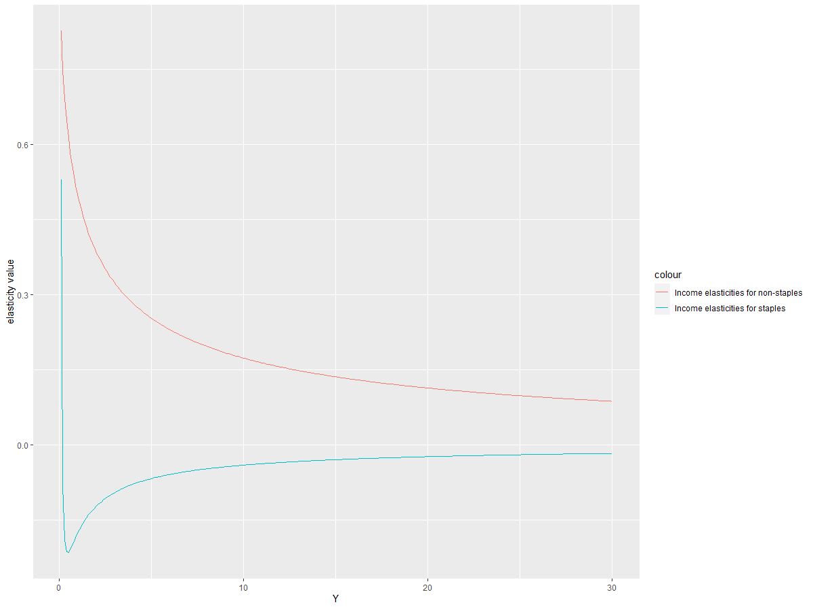
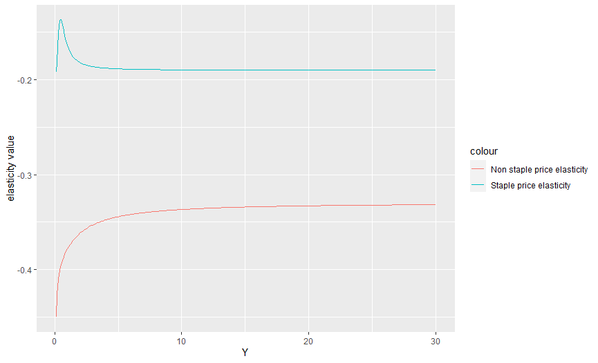

# Summary

Ambrosia was developed to calculate food demand for staples and non-staple commodities that is responsive to changing levels of incomes and prices. Ambrosia implements the framework for food demand established by Edmonds et al[@edmonds2017global] and allows the user to explore and estimate different variables related to the food demand system. Currently ambrosia serves 3 main functions,

(1) The user can calculate food demand for any given set of parameters, income levels and prices
(2) The user can also estimate their own set of parameters given a dataset. Note that currently ambrosia is used to calculate parameters for the food demand model implemented in the Global Change Analysis Model (GCAM)[@calvinetal2016global],[@calvin2019gcam]
(3) The user can also explore and clean a raw data set before starting that parameter estimation  

## Summary of the Edmonds et al framework
The Edmonds et al model [@edmonds2017global] represents a food demand model for staples and non-staple commodities at different levels of prices and incomes. Demand for staples increases at low income, but eventually peaks (at under 1000$ per person per capita) and begins to decline with higher income. Demand for non-staples increases with income over all income ranges; however, total (staple + non-staple) demand saturatesat high income levels[@edmonds2017global]. 

The Edmonds et al approach uses a 11 parameter model where the parameters are fit using pooled cross-sectional-timeseries observations and a Bayesian Monte Carlo method[@edmonds2017global]. The framework represents demand for 3 categories of goods staples(s), non-staples(n) and materials (m) (materials represent everything in the economy other than staples and non-staple food commodities). The demand for these 3 categories changes with changes in income (Y) and prices (P). Expenditures on these 3 goods are  assumed to exhaust income.  

Thus demand for these 3 categories can be represented mathematically as,

(1)Staple demand: $q_{s} = A_{s}(x^{h_{s}(x)})(w_{s}^{e_{ss(x)}})(w_{n}^{e_sn(x)})$

(2)Non-staple food demand: $q_{n} = A_{n}(x^{h_{n}(x)})(w_{s}^{e_{ns(x)}})(w_{n}^{e_nn(x)})$

(3)Materials demand : $q_{m} = x - w_{s}q_{s} - w_{n}q_{n}$

Where $w_{i}$ is $P_{i}/P_{m}$, $x$ is $Y/P_{m}$ and $A_{i}$ are constants. 

$e_{ij}$ is defined in a general way ,

(4)$e_{ij}(x)=g_{ij}*f_{i}(x){\alpha}_{j}$

where $g_{i,j}$ are constants, $i >= j$ and $f_{i}(x) = ({\delta}ln(x_{h_{i}}(x)))/({\delta}ln(x))$  

If $h$ and $e$ were constants, $h$ would be an income elasticity as $x= Y/P_{m}$ and $e_{ij}$ would be own and cross price elasticity as $w_{i}= P_{i}/P_{m}$

The following functional forms are chosen for $h_{s}$ and $h_{n}$,

(5) $h_{s}(x) = ({\lambda}/x)(1+({\alpha}/ln(x)))$

(6) $h_{n}(x) = {\nu}/(1-x)$

In addition to the above, two other scaling parameters are applied when normalizing the demand values to that of materials. These are $psscl$ for staples and $pnscl$ for non-staples.

The table below summarizes all of the parameters described above,

| parameter name | Description                                  | value (from the latest iteration of the model) |
|----------------|----------------------------------------------|-----------------------------------------------|
| A_s            | Scaling parameter for staples (constant)     | 1.13                                          |
| A_n            | Scaling parameter for non-staples (constant) | 1.24                                          |
| xi_ss          | Price elasticity for staples                 | -0.024                                        |
| xi_cross       | Cross price elasticity                       | -0.010                                        |
| xi_nn          | Price elasticity for non_staples             | -0.143                                        |
| nu1_n          | Income elasticity for non-staples            | 0.5                                           |
| lambda_s       | Income elasticity for staples                | 0.0476                                        |
| k_s            | Value of income (Y) at which elasticity is 0 | 16.0                                          |
| Pm             | Price of materials                           | 5.13                                          |
| psscl          | Additional scaling parameter for staples     | 100.0                                         |
| pnscl          | Additional scaling parameter for non-staples | 20.1                                          |

The parameters are fit in the model by using a weighted least square log likelihood function [@carrol1988] described below.

(7) $ln(L) = {\Sigma}_{i=1}^{N}(w_{i}(y_{i}-\hat{y_{i}})^{2})/2{\sigma^{2}}$

where, $y_{i}$ is the $i$th data value and $\hat{y_{i}}$ is the corresponding model outputand $w_{i}$ is the weight assigned to the data point. Since the parameters were fit based on regional data, the regional population was used as the weight. 

By applying the 11 parameters to the equations described above, the user can generate estimates of demand for staples and non staple commodities in thousand calories  across different income levels and prices. Figure 1 below shows the estimates of demand for staples and non-staples across a range of incomes, when prices for staples and non-staples are held constant at median values from the observational dataset.


# Statement of need
```ambrosia``` is part of an ecosystem of tools that help users computationally explore science and policy questions related to different dimensions of human earth systems. The parameters calculated from ambrosia are utilized directly in the agricultural and economic modules of the Global Change Analysis Model (GCAM) which is a complex human earth system model[@calvin2019gcam]. Note that the equations described above are also implemented in GCAM in C++. ```ambrosia``` ensures that the parameters that are used within GCAM are scientifically and empirically sound and also ensures reproducability of the parameters for validations and scientific publications.The code is structured to ensure that the parameters can be updated and tested easily with changes in underlying data.    

Just as ```ambrosia``` is used to explore questions related to food consumption, other tools in the ecosystem described above are used to explore other relevant dimensions of human earth systems. The ```moirai``` land data system is used to enhance the exploration of land use change decisions in GCAM[@di2020moirai], ```hector``` is used to explore questions related to feedback to and from climate to human earth systems[@hartin2015hector], ```xanthos``` is used to explore changes in hydological cycles[@li2017xanthos] and ```demeter``` is used to disaggregate land cover so as to enable earth system models to simulate biophysical and biogeochemical fluxes[@vernon2018demeter]. 

In addition to providing scientifically sound parameters for GCAM, ambrosia has been developed to help researchers explore questions related to trends in food demand empirically. Since the equations of the model are grounded in peer reviewed reserach while the code itself is written in R (which increases usability), we believe that the tool will be useful to researchers interested in ,

a) Analyzing trends in food demand with a model that is responsive to changes in incomes and prices, that can easily be implemented on any simple time series (dataset).
b) Incorporating a detailed food demand model in their own earth system/economic model

Another motivation to develop ambrosia is functionalizing and separating out the different components of the sophisticated food demand framework described above into simple R functions that can be easily parameterized and customized by the user. The sections below contain a detailed discussion of the different functions and customization options available within the tool. In this way, the model not only enables easy use and future development, but also enables easy modularization of the code within other systems.        

# Functions and customization 

The $ambrosia_vignette.rmd$ provides usable examples for the major functions within the code. As described in the summary statement, the functions within ambrosia can be classified into three distinct categories

1) Functions to explore food demand variables
2) Functions to estimate parameters using custom data 
3) Functions to process raw data for parameter estimation

In addition to these, the code contains a number of helper functions that may be useful to the user depending upon their research requirements.

## Functions to explore demand variables

First and foremost, the ambrosia package can be easily loaded as a standard R pacage after installation from github. The user can calculate demand for staples and non-staples using the  ```food.dmnd()``` function. The user will only have to pass in a dataset with the price of staples ($Ps$), price of non-staples ($Pn$), incomes ($Y$) in GDP per capita in thousand USD. In addition to the dataset, the user must pass a vector of 11 parameters. In order to functionalize the parameters, the code contains a function called ```vec2param()``` that will generate a parameter structure that can be used by the food demand function. The usage of the functions are described in the example below. The example makes use of the vector of parameters directly from Edmonds et al. The food demand function is implemented using equations (1),(2),(3) desbcribed above. 

```R
#Example 1: Creating estimates of demand 

#Parameter values are taken from Edmonds et al (Pg 12, Table 3 )

original_param_vector <- c(1.28,1.14,-0.19,0.21,-0.33,0.5,0.1,16,5.06,100,20)

#Names of the parameters above are as follows. These are the same as the names in Table 1 above  

parameter_names <- c('A_s', 'A_n', 'xi_ss', 'xi_cross', 'xi_nn', 'nu1_n',
                     'lambda_s', 'k_s', 'Pm', 'psscl','pnscl')

#Generate parameter set for the food demand model

params <- vec2param(original_param_vector)                     

#Create a sample dataset
Test_Data<-data.frame(Y=seq(0.1,30, by=0.1))
Test_Data %>% mutate(Ps=0.1,Pn=0.2)->Test_Data

Food_Demand<-food.dmnd(Ps = Test_Data$Ps,
                       Pn = Test_Data$Pn,
                       Y = Test_Data$Y,
                       params = params)
```

Using the function above will create a dataframe with estimates of demand for each level of price and incomes and also the budget shares (shares of incomes spent) for staples and non-staples. Plotting these result in Figure 2 and Figure 3 below respectively 


The demand code iteratively solves for the budget shares using a broyden solver with changing incomes and re-calculates income and price elasticities for changes in budget shares. Thus the elasticity values parameters change with changes in income. The user can  separately analyze the income elasticities by using two functions (one for staples and other for non-staples) from within the parameter structure generated above. These functions implement equations (5) and (6) described above for a given level of income (Y). This is explained in the example below  

```R
#Example 2: Calculating/Analyzing income elasticities 

#As explained in the documentation of these functions, setting the second parameter to TRUE will generate
#the Y term (Y ^ elasticity) as opposed to the elasticity itself.

#Get income elasticities for staples (1st function)
Food_Demand$eta.s <- params$yfunc[[1]](Y=Food_Demand$Y,FALSE)

#Get income elasticities for staples (1st function)
Food_Demand$eta.n <- params$yfunc[[2]](Y=Food_Demand$Y,FALSE)

```
The results from the above can be plotted to result in the following plot that shows the relationship of income elasticities to income levels.



Similar to the income elasticities, the user can also calculate and analyze price elasticities. These elasticities are calculated in accordance with equation (4) described above. The function ```calc1eps()``` can be used to recalculate price elasticities by passing  the following parameters:

a)different budget shares (alphas)

b)income elasticities (calculated in example 2)

c)A matrix of values for elasticities (This is a part of the parameter structure set up in example 1) 

The functions to derive price elasticities are described in the example below.

```R
#Example 3: Calculating/Analyzing price elasticities 

Food_Demand$staple_price_elasticity <- calc1eps(Food_Demand$alpha.s,Food_Demand$alpha.n,Food_Demand$eta.s,Food_Demand$eta.n,tmp_param$xi)[1:300]


Food_Demand$non_staple_price_elasticity <- calc1eps(Food_Demand$alpha.s,Food_Demand$alpha.n,Food_Demand$eta.s,Food_Demand$eta.n,tmp_param$xi)[901:1200]
```
Similar to the income elasticities, these can now be plot against incomes as seen in Fig 6. below


## Functions to process raw data for parameter estimation

As mentioned in the statement of need, one of the benefits of using ```ambrosia``` is that a user can estimate their own parameters with a custom data set using the log-likelihood maximization approach. To enable this, ```ambrosia``` is equipped with a function (```create_dataset_for_parameter_fit()```) that will help a user generate a dataset that is appropriate for parameter estimation. There are a few steps that the function will perform on a sample dataset. 

1) Firstly,it will ensure that the user's dataset contains all columns required for parameter estimation
2) It will filter out anomalies and outliers using parameter values selected by the user. This step is necessary since data on food consumption and prices are often incomplete which may lead to unrealistically high or low values of consumption or prices in the dataset.
3) After this, the function will create clusters of observations from the dataset based on income levels, and prices of staples and non-staples. This step is necessary because parameters are fit by maximizing a log likelihood function (as described in equation (7)) by calculating observational error (Whisch is the denominator in the equation). But this being economic data, the observational error can only be calculated within different clusters. The code will also check for a  user specified minimum number of clusters(If there are anomalies within the dataset, the clustering can be incorrect leading in a small number of clusters). The clustering is implemented using the Divisive Analysis Clustering Algorithm (DIANA). 
4) Once the clustering is completed, the code will calculate the observational error which is the variance in food demand for staples (${\sigma}^{2}Qs$) and non-staples (${\sigma}^{2}Qn$) .Note that the user can chose a lower limit on the observational error calculated. The default value of the lower limit is 0.01.  

In addition to a dataframe, the function will return a csv output called "Processed_Data_for_MC.csv" that is stored in the outputs folder that will be used for the parameter estimation. The example below illustrates how to use the function on a raw dataset.

```R
#Example 3: Creating a dataset for parameter fitting 

parameter_data <- create_dataset_for_parameter_fit(data=Sample_Data,
                                             min_clusters = 100,
                                             min_price_pd = 20,
                                             min_cal_fd = 1000,
                                             lower_limit_sigma = 0.01)
```

The dataset returned by this function can now be used for effective parameter estimation. The user can also plot the observational errors for staples and non-staples to ensure there is a valid distribution and the data is not skewed. 


## Functions for parameter estimation

Finally, the user can complete the parameter estimation on the dataset returned by ```create_dataset_for_parameter_fit()``` with a call to the ```calculate_ambrosia_params()``` function. As mentioned in the earlier sections, the parameter estimation is implemented by maximizing a least squares log likelihood function. The first parameters for the Edmonds et al model were fit using a Markov Chain Monte Carlo simulation to maximize the log-likehood score. ```ambrosia``` builds on this approach by maximizing the log-likelihood score using the ```optim()``` function. The following steps are involved in the parameter estimation function,

1) First a log-likelihood function is set up with the data returned by the function above. This function uses equation (7) described above.
2) Now, the value returned by this function will be maximized using ```optim()```. The user can provide a seed of initial parameters to begin the optimization process (the lowest possible seed would be the lowest values of all 11 parameters). The default seed is set to the original parameters from Edmonds et al. The user can also specify the optimization method to be used. The default is set to the "BFGS" method, but the user can also run the optimization using methods such as "Neldor-Mead" etc. 
3) The function will now return a vector of parameters that can be used to derive estimates of food demand (Similar to Example 1 above). The function also prints out the maximized value of the log-likelihood function, so that the user can verify the efficiency and effectiveness of the parameter estimation.

The example below illustrates the use of this function along with all parameters. 

```R
#Example 4: Estimating parameters 

parameter_data <- calculate_ambrosia_params(optim_method = "BFGS",
                                        original_param_vector= c(1.28,1.14,-0.19,0.21,-0.33,0.5,0.1,16,5.06,100,20),
                                        datadir = "outputs/Processed_Data_for_MC.csv")
```
## Other functions

In the addition to the main functions described above, ambrosia also includes a number of supplementary functions that are used within the main functions themselves that the user can customize to suit their research needs. These functions are summarized in the table below.


| Category              | Function name           | Description                                                                                                      |
|-----------------------|-------------------------|---------------------------------------------------------------------|
| Parameter estimation  | mc.eval.fd.likelihood() | The function will return the log likelihood value for a set of parameters and a given set of observational data. |
|                       | mc.setup()              | Function returned by mc.setup() is used to fit parameters using the maximization approach                        |
| Data processing       | recursive.partition()   | A function that is used for clustering using the DIANA approach using any criteria variables                     |
|                       | assign.sigma.Q()        | Computes observational errors within clusters for staple and non staple food demand                              |
|                       | calc.pop.weight()       | Calculates weights used in equation (7) for the least squares log likelihood function                            |
| Food demand functions | calc.elas.actual()      | Calculates elasticities using numerical derivatives for given prices and incomes.                                |
|                       | calc.hicks.actual()     | Calculates Hicks elasticities using a Slutsky equation                |

## Other outputs

In addition to the outputs described above, the model will generate 2 outputs as csv files for testing and validation. Firstly, the ```Processed_Data_for_MC.csv``` is saved as an output of the ```create_dataset_for_parameter_fit()``` function. This dataset is used to fit the parameters and is also used by the testing suite to ensure outputs are valid.```parameter_data.csv``` is saved as an output of the ```calculate_ambrosia_params()``` function. This is the final set of parameters with their scientifc names that is passed to GCAM. The testing suite will also test this final set of parameters to ensure validity.


# Availability

## Operating system
Mac OS X; Linux; Windows 

## Programming language
R (>= 3.3.0)

## Dependencies
dplyr (>= 0.7)

nleqslv (>= 3.2)

reshape2 (>= 1.4.3)

ggplot2 (>= 2.2.1)

cluster (>= 2.0)

tidyr  (>= 0.7.1)

## Code repository

$Name$- Github

$Identifier$- https://github.com/JGCRI/ambrosia/tree/master

$License$- Apache License 2.0


# Acknowledgements

This research was supported by the U.S. Department of Energy (DOE), Office of Science, Office of Biological and Environmental Research, as a part of research in the MultiSector Dynamics, Earth and Environmental System Modeling Program.

# References
