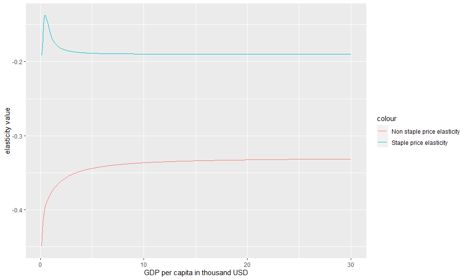
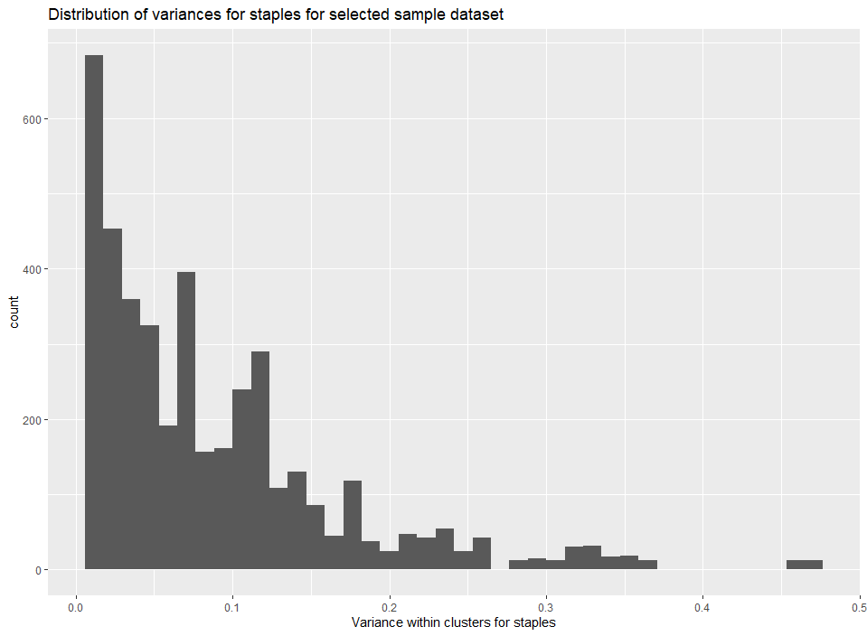

```{r setup, include=FALSE}
knitr::opts_chunk$set(echo = TRUE)
```

## Introduction

```r
#load libraries
library(ambrosia)
library(dplyr)
library(ggplot2)
library(knitr)
```
# Part 1: Calculating food demand, exploring demand side variables for a given set of parameters 


## Example 1.1: Get parameters
```r
#Use a sample vector of parameters. 
c(1.28,1.14,-0.19,0.21,-0.33,0.5,0.1,16,5.06,100,20) -> original_param_vector

#These are the names of the parameters
parameter_names <- c('A_s', 'A_n', 'xi_ss', 'xi_cross', 'xi_nn', 'nu1_n',
                     'lambda_s', 'k_s', 'Pm', 'psscl','pnscl')

#Create a dataframe of parameters
parameter_data <- data.frame(parameter_names,original_param_vector)

#Return a parameter structure
tmp_param <- vec2param(original_param_vector)

#Return a table of parameters
kable(parameter_data ,col.names = c("parameter_name","value"),format = "pandoc")

```

## Example 1.2: Calculate food demand
```r
#Get a sample data set
Test_Data <- data.frame(Y=seq(0.1,30, by=0.1))

#Add sample values of Ps and Pn
Test_Data %>% mutate(Ps=0.1,Pn=0.2)->Test_Data

#Add some sample parameters
sample_parameters <- c(1.28,1.14,-0.19,0.21,-0.33,0.5,0.1,16,5.06,100,20)

#Calculate food demand
Food_Demand <- food.dmnd(Test_Data$Ps,Test_Data$Pn,Test_Data$Y,params=vec2param(sample_parameters))
```

## Example 1.3: Visualize food demand
```r

#Add income and total demand to the data frame created in example 1.2 and create a plot.  

Food_Demand$Total_Demand <- Food_Demand$Qs+Food_Demand$Qn
Food_Demand$Y <- seq(0.1,30, by=0.1)

#Create the plot
g<-ggplot()+
    geom_line(data=Food_Demand,aes(x= Y,y= Qs,color= "Staple Demand"))+
    geom_line(data=Food_Demand,aes(x= Y,y= Qn,color= "Non Staple Demand"))+
    xlab("GDP per capita in thousand USD" )+
    ylab("Thousand calories")+
    ggtitle("Calculated values of food demand using model parameters")+
    labs(subtitle="Prices are set to 0.1 for Staples and 0.2 for Non-staples. This is the same as fig 1 from Edmonds et al")

#Plot
plot(g)    
```
{width=50% height=50%} 

## Example 1.4: Visualize budget shares
```r
#Rename the budget shares columns
budget_shares <- Food_Demand %>% 
                 mutate(share_of_staples= alpha.s*100,
                        share_of_non_staples= alpha.n*100,
                        share_of_materials= alpha.m*100)

#Add some income or Y values
budget_shares$Y <- seq(0.1,30, by=0.1)

#Create the plot
g<-ggplot()+
  geom_line(data=budget_shares,aes(x=Y,y=share_of_staples,color="Staple share"))+
  geom_line(data=budget_shares,aes(x=Y,y=share_of_non_staples,color="Non Staple share"))

#Plot
plot(g)
```
{width=50% height=50%} 

## Example 1.5: Calculate income elasticities
```r
#Note that setting the second argument to "TRUE" in the functions below would return the Y term (Y^elas) as opposed to the elasticity.

Food_Demand$eta.s <- tmp_param$yfunc[[1]](Y=Food_Demand$Y,FALSE)
Food_Demand$eta.n <- tmp_param$yfunc[[2]](Y=Food_Demand$Y,FALSE)

#Create data for the plot
g<-ggplot()+
  geom_line(data=Food_Demand,aes(x=Y,y=eta.s,color="Income elasticities for staples"))+
  geom_line(data=Food_Demand,aes(x=Y,y=eta.n,color="Income elasticities for non-staples"))

#Plot
plot(g)
```
{width=50% height=50%} 

## Example 1.6: Calculate price elasticities
```r
#calc1eps returns a matrix of elasticities where the matrices are elasticities for staples(matrix 1), cross price #elasticities(matrix 2,3),non_staple elasticities(matrix 4))

#Get staple price and income elasticities
Food_Demand$staple_price_elasticity <- calc1eps(Food_Demand$alpha.s, Food_Demand$alpha.n , Food_Demand$eta.s , Food_Demand$eta.n, tmp_param$xi)[1:300]
Food_Demand$eta.n <- tmp_param$yfunc[[2]](Y=Food_Demand$Y,FALSE)

#Get non-staple price and income elasticities
Food_Demand$non_staple_price_elasticity <- calc1eps(Food_Demand$alpha.s,Food_Demand$alpha.n,Food_Demand$eta.s,Food_Demand$eta.n,tmp_param$xi)[901:1200]
Food_Demand$eta.n <- tmp_param$yfunc[[2]](Y=Food_Demand$Y,FALSE)

g<-ggplot()+
  geom_line(data=Food_Demand,aes(x=Y,y=staple_price_elasticity,color="Staple price elasticity"))+
  geom_line(data=Food_Demand,aes(x=Y,y=non_staple_price_elasticity,color="Non staple price elasticity"))

#Plot
plot(g)
```
{width=50% height=50%} 


# Part 2: Calculating model parameters from raw data

## Example 2.1: Get a dataset for parameter fitting from a sample training dataset

### Warning: This might take a long time to run since we are using the entire training dataset
```r
#Load the training data
data("training_data") 

#Create a dataset for parameter fit
temp_data <- create_dataset_for_parameter_fit(data=training_data,min_clusters = 300,min_price_pd = 20,min_cal_fd = 1700,outdir=tempdir()) 
```

## Example 2.2: Analyze distribution of observational error for non-staples
```r
#Load example processed_data 
data("processed_data_example")

#Create a plot using example loaded above or data generated in example 2.1
g<-ggplot()+
   geom_histogram(data=processed_data_example,aes(x=sig2Qn),bins = 40)+
   xlab("Observational error within clusters for non-staples")+
   ggtitle("Distribution of observational error for non-staples for selected sample dataset")

#Plot
plot(g)   
```
{width=50% height=50%} 

## Example 2.3: Analyze distribution of observational error for staples
```r
#Load example processed_data 
data("processed_data_example")

#Create a plot using example loaded above or data generated in example 2.1
g<-ggplot()+
   geom_histogram(data=processed_data_example,aes(x=sig2Qs),bins = 40)+
   xlab("Observational error within clusters for staples")+
   ggtitle("Distribution of observational error for staples for selected sample dataset")

#Plot   
plot(g)   
```
{width=50% height=50%} 

## Example 2.4: Calculate actual parameters

### Warning: Calculating parameters takes a long time (around 25 minutes)

```r

#load sample data
data("processed_data_example")

#write it to a temporary csv
write.csv(processed_data_example,"Processed_Data_for_MC.csv")

#calculate new parameters using this saved dataset
new_parameters <- calculate_ambrosia_params(datadir="Processed_Data_for_MC.csv",
                                            optim_method = "BFGS",
                                            original_param_vector= c(1.28,1.14,-0.19,0.21,-0.33,0.5,0.1,16,5.06,100,20))
```

## Example 2.5: Set up a log likelihood function based on observational data

```r

#The log likelihood function set up below can be used to fit parameters either using the maximization function or any #other approach like a Markov Chain Monte Carlo

#load sample data
data("processed_data_example")

#write it to a temporary csv
write.csv(processed_data_example,"Processed_Data_for_MC.csv")

#Now, set up a log likelihood function using the saved data
func_MC <- mc.setup("Processed_Data_for_MC.csv")

```
## Example 2.6: Calculate the log likelihood score based on the parameters (vector) calculated in Example 10 and the log likelihood function calculated in Example 2.4

```r
if(!exists(new_parameters)){

print("New parameters not calculated as shown in example 2.4. Loading pre-saved parameters")

new_parameters <- c(1.28,1.14,-0.19,0.21,-0.33,0.5,0.1,16,5.06,100,20)

}

#calculate the likelihood score using the function calculated in example 2.5
likelihood_score <- func_MC(c(new_parameters))

```

# Part 3: Running the interactive version of the model


## Example 3.1: Run the interactive version of the model

```r

runapp()

```

# Part 4: Exploring data from a MCMC calculation 


## Example 4.1: Read in mc.data and create density plots

```r
#Load example data
data("mc_data_example")

#write it to a temporary file as an example
write.table(mc_data_example,"mc_data_example.dat")

#Read the table
#nparam is set to 9 since the original MCMC was implemented for 9 parameters
mc_example <- read.mc.data("mc_data_example.dat",varnames = namemc(nparam = 9))

#Create the density plot
mcparam.density(mc_example)

```
{width=50% height=50%}

## Example 4.2: Re-create maximum probability density

```r
#Load example data
data("mc_data_example")

#write it to a temporary file as an example
write.table(mc_data_example,"mc_data_example.dat")

#Read the table
mc_example <- read.mc.data("mc_data_example.dat",varnames = namemc(nparam = 9))

#The function  below will return a vector of parameters which yield the highest log likelihood score
mcparam.ML(mc_example) -> ml_parameters

#Now, set up the log likelihood function with the dataset used to calculate original parameters 

data("data_used_for_original_param")

write.csv(data_used_for_original_param, "original_data.csv")

func_MC <- mc.setup("original_data.csv")

#Now calculate the probability density. Add in the price scaling parameters (which were held constant during the MCMC). The value should be -195

probability_density <- func_MC(c(ml_parameters,100,20))

```
