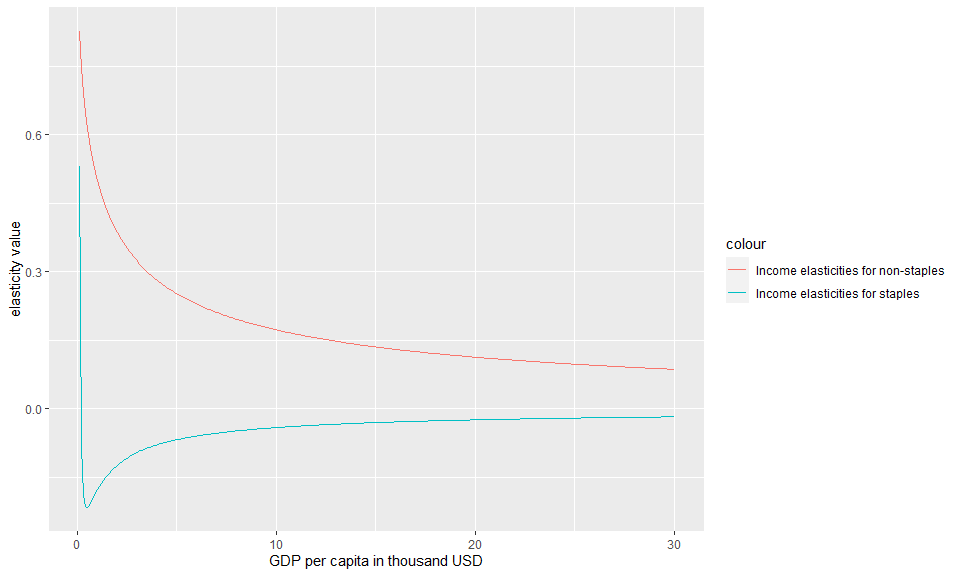

```{r setup, include=FALSE}
knitr::opts_chunk$set(echo = TRUE)
```

## Introduction
This is an [R Markdown](http://rmarkdown.rstudio.com) Notebook. When you execute code within the notebook, the results appear beneath the code. 

Try executing this chunk by clicking the *Run* button within the chunk or by placing your cursor inside it and pressing *Ctrl+Shift+Enter*. 

```{r}
#load libraries
library(ambrosia)
suppressMessages(library(dplyr))
suppressMessages(library(ggplot2))
suppressMessages(library(knitr))
```
# Part 1: Calculating food demand, exploring demand side variables for a given set of parameters 


## Example 1: Get parameters
```{r}

c(1.28,1.14,-0.19,0.21,-0.33,0.5,0.1,16,5.06,100,20)->original_param_vector

parameter_names<-c('A_s', 'A_n', 'xi_ss', 'xi_cross', 'xi_nn', 'nu1_n',
                     'lambda_s', 'k_s', 'Pm', 'psscl','pnscl')
parameter_data<-data.frame(parameter_names,original_param_vector)

tmp_param<-vec2param(original_param_vector)

kable(parameter_data ,col.names = c("parameter_name","value"),format = "pandoc")

```

## Example 2: Calculate food demand
```{r}
#Get a sample data set
Test_Data <- data.frame(Y=seq(0.1,30, by=0.1))

#Add sample values of Ps and Pn
Test_Data %>% mutate(Ps=0.1,Pn=0.2)->Test_Data

#Add some sample parameters
sample_parameters <- c(1.28,1.14,-0.19,0.21,-0.33,0.5,0.1,16,5.06,100,20)

#Calculate food demand
Food_Demand<-food.dmnd(Test_Data$Ps,Test_Data$Pn,Test_Data$Y,params=vec2param(sample_parameters))
```

## Example 3: Visualize food demand
```r
Food_Demand$Total_Demand<-Food_Demand$Qs+Food_Demand$Qn
Food_Demand$Y<-seq(0.1,30, by=0.1)


g<-ggplot()+
    geom_line(data=Food_Demand,aes(x=Y,y=Qs,color="Staple Demand"))+
    geom_line(data=Food_Demand,aes(x=Y,y=Qn,color="Non Staple Demand"))+
    xlab("GDP per capita in thousand USD" )+
    ylab("Thousand calories")+
    ggtitle("Calculated values of food demand using model parameters")+
    labs(subtitle="Prices are set to 0.1 for Staples and 0.2 for Non-staples. This is the same as fig 1 from Edmonds et al")
```
{width=50% height=50%} 

## Example 4: Visualize budget shares
```r

budget_shares <- Food_Demand %>% 
                 mutate(share_of_staples=alpha.s*100,
                        share_of_non_staples=alpha.n*100,
                        share_of_materials=alpha.m*100)

budget_shares$Y<-seq(0.1,30, by=0.1)

g<-ggplot()+
  geom_line(data=budget_shares,aes(x=Y,y=share_of_staples,color="Staple share"))+
  geom_line(data=budget_shares,aes(x=Y,y=share_of_non_staples,color="Non Staple share"))+
  #geom_line(data=budget_shares,aes(x=Y,y=share_of_materials,color="Materials share"))+
    xlab("GDP per capita in thousand USD" )+
    ylab("Percent of Income")
    # ggtitle("Calculated budget shares using food demand parameters")+
    # labs(subtitle="Prices are set to 0.1 for Staples and 0.2 for Non-staples")

```
{width=50% height=50%} 

## Example 5:Calculate income elasticities
```r

#Note that setting the second argument to "TRUE" in the functions below would return the Y term (Y^elas) as opposed to the elasticity.
Food_Demand$eta.s <- tmp_param$yfunc[[1]](Y=Food_Demand$Y,FALSE)
Food_Demand$eta.n <- tmp_param$yfunc[[2]](Y=Food_Demand$Y,FALSE)

g<-ggplot()+
  geom_line(data=Food_Demand,aes(x=Y,y=eta.s,color="Income elasticities for staples"))+
  geom_line(data=Food_Demand,aes(x=Y,y=eta.n,color="Income elasticities for non-staples"))+
  #geom_line(data=budget_shares,aes(x=Y,y=share_of_materials,color="Materials share"))+
    xlab("GDP per capita in thousand USD" )+
    ylab("Ealsticity value")
    # ggtitle("Calculated income elasticities for each level of income")+
    # labs(subtitle=paste0("Income elasticity parameter value for staples and non-staples are ",original_param_vector[7]," ,",original_param_vector[6]," respectively"))

```
{width=50% height=50%} 

## Example 6:Calculate price elasticities
```r

#calc1eps returns a matrix of elasticities where the matrices are elasticities for staples(matrix 1), cross price elasticities(matrix 2,3),non_staple elasticities(matrix 4))


Food_Demand$staple_price_elasticity <- calc1eps(Food_Demand$alpha.s,Food_Demand$alpha.n,Food_Demand$eta.s,Food_Demand$eta.n,tmp_param$xi)[1:300]
Food_Demand$eta.n <- tmp_param$yfunc[[2]](Y=Food_Demand$Y,FALSE)

Food_Demand$non_staple_price_elasticity <- calc1eps(Food_Demand$alpha.s,Food_Demand$alpha.n,Food_Demand$eta.s,Food_Demand$eta.n,tmp_param$xi)[901:1200]
Food_Demand$eta.n <- tmp_param$yfunc[[2]](Y=Food_Demand$Y,FALSE)

g<-ggplot()+
  geom_line(data=Food_Demand,aes(x=Y,y=staple_price_elasticity,color="Staple price elasticity"))+
  geom_line(data=Food_Demand,aes(x=Y,y=non_staple_price_elasticity,color="Non staple price elasticity"))+
  #geom_line(data=budget_shares,aes(x=Y,y=share_of_materials,color="Materials share"))+
    xlab("GDP per capita in thousand USD" )+
    ylab("Ealsticity value")
    # ggtitle("Calculated price elasticities for each level of income")+
    # labs(subtitle=paste0("price elasticity parameter value for staples and non-staples are ",original_param_vector[3]," ,",original_param_vector[5]," respectively"))

```
{width=50% height=50%} 


# Part 2: Calculating model parameters from raw data

## Example 7: Get a dataset for parameter fitting from a sample training dataset

### Warning: This might take a long time to run since we are using the entire training dataset
```r
Sample_Data <- read.csv("Training_Data.csv") 

temp_data <- create_dataset_for_parameter_fit(data=Sample_Data,min_clusters = 300,min_price_pd = 20,min_cal_fd = 1700) 
```

## Example 8: Analyze distribution of observational error for non-staples
```r
g<-ggplot()+
   geom_histogram(data=temp_data,aes(x=sig2Qn),bins = 40)+
   xlab("Observational error within clusters for non-staples")+
   ggtitle("Distribution of observational error for non-staples for selected sample dataset")
```
{width=50% height=50%} 

## Example 9:Analyze distribution of observational error for staples
```r
g<-ggplot()+
   geom_histogram(data=temp_data,aes(x=sig2Qs),bins = 40)+
   xlab("Observational error within clusters for staples")
   ggtitle("Distribution of observational error for staples for selected sample dataset")
```
{width=50% height=50%} 

## Example 10:Calculate actual parameters

### Warning: Calculating parameters takes a long time (around 25 minutes)

```r

new_parameters <- calculate_ambrosia_params(datadir="outputs/Processed_Data_for_MC.csv",
                                            optim_method = "BFGS",
                                            original_param_vector= c(1.28,1.14,-0.19,0.21,-0.33,0.5,0.1,16,5.06,100,20))
```

## Example 11: Set up a log likelihood function based on observational data

```r

#The log likelihood function set up below can be used to fit parameters either using the maximization function or any other # approach like a Markov Chain Monte Carlo

func_MC <- mc.setup("outputs/Processed_Data_for_MC.csv")

```
## Example 12: Calculate the log likelihood score based on the parameters (vector) calculated in Example 10 and the log likelihood function calculated in Example 11

```r


likelihood_score <- func_MC(c(new_parameters))

```

# Part 3: Running the interactive version of the model


## Example 13: Run the interactive version of the model

```r

runapp()

```

# Part 4: Exploring data from a MCMC calculation 


## Example 14: Read in mc.data and create density plots

```r

#nparam is set to 9 since the original MCMC was implemented for 9 parameters

mc_example <- read.mc.data("test_outputs/mc_data_example.dat",varnames = namemc(nparam = 9))

mcparam.density(mc_example)
```
{width=50% height=50%}

## Example 15: Re-create maximum probability density

```r

#The function  below will return a vector of parameters which yield the highest log likelihood score

mcparam.ML(mc_example) -> ml_parameters

#Now, set up the log likelihood function with the dataset 

func_MC <- mc.setup("outputs/Processed_Data_for_MC.csv")

#Now calculate the probability density. Add in the price scaling parameters (which were held constant during the MCMC)

probability_density <- func_MC(c(ml_parameters,100,20))

```
