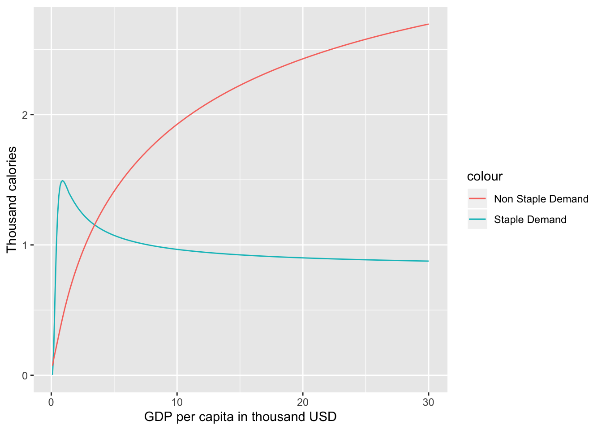
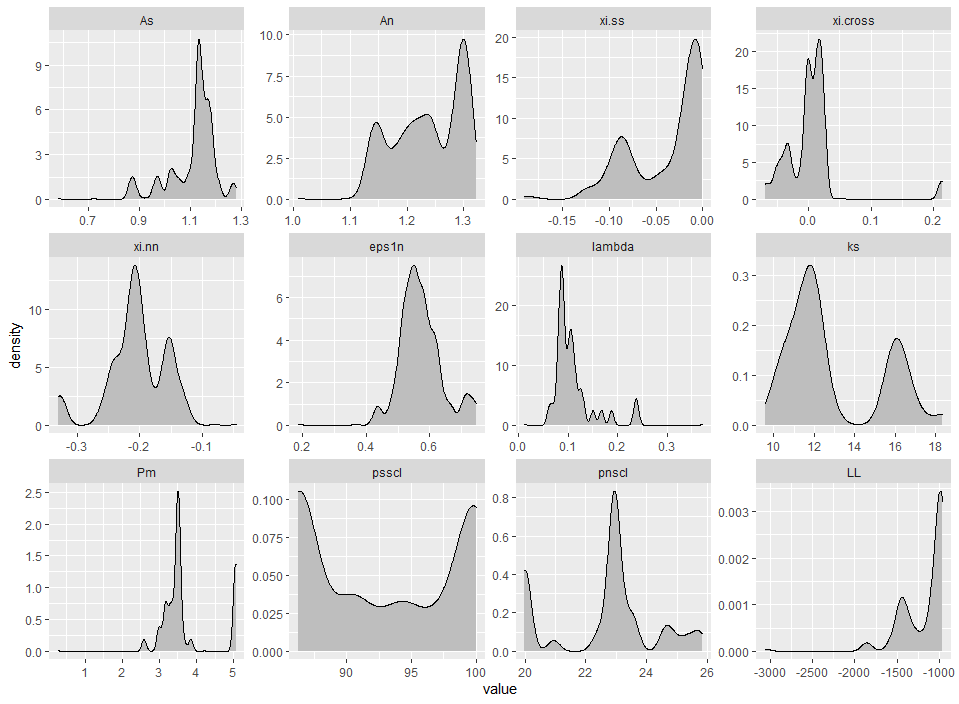

```{r setup, include=FALSE}
knitr::opts_chunk$set(echo = TRUE)
```

## Introduction
```r
#load libraries
library(ambrosia)
library(dplyr)
library(ggplot2)
library(knitr)
```
# Part 1: Calculating food demand, exploring demand side variables for a given set of parameters 

This section explains how a user can set up the parameter structure for the `ambrosia` and explore the basic demand side variables.


## Example 1.1: Calculate food demand

Demand in thousand calories can be calculated for different levels of income (`Y`) in thousand USD per capita for different prices of staples (`Ps`) and non-staples (`Pn`) both in $ per capita per day using the parameters calculated in example 1.1. 

```r
#Get a sample data set
Test_Data <- data.frame(Y=seq(0.1,30, by=0.1))

#Add sample values of Ps and Pn
Test_Data <- Test_Data %>% mutate(Ps=0.1,Pn=0.2)

#Calculate food demand
Food_Demand <- food.dmnd(Test_Data$Ps,Test_Data$Pn,Test_Data$Y)

```
## Example 1.2: Visualize food demand

The demand along with the price and income elasticities calculated using the `food.dmnd()` function  can be visualized easily.   

```r
#Add income and total demand to the data frame created in example 1.1 and create a plot.  
Food_Demand$Total_Demand <- Food_Demand$Qs+Food_Demand$Qn
Food_Demand$Y <- seq(0.1,30, by=0.1)

#Create the plot
g <- ggplot()+
    geom_line(data=Food_Demand,aes(x= Y,y= Qs,color= "Staple Demand"))+
    geom_line(data=Food_Demand,aes(x= Y,y= Qn,color= "Non Staple Demand"))+
    xlab("GDP per capita in thousand USD" )+
    ylab("Thousand calories")

#Plot
plot(g)    
```
{width=50% height=50%} 

## Example 1.3: Visualize budget shares

Using the function above will create a dataframe with estimates of demand for each level of price and incomes and also the budget shares (shares of incomes spent) for staples and non-staples.

```r
#Rename the budget shares columns
budget_shares <- Food_Demand %>% 
                 mutate(share_of_staples= alpha.s*100,
                        share_of_non_staples= alpha.n*100,
                        share_of_materials= alpha.m*100)

#Add some income or Y values
budget_shares$Y <- seq(0.1,30, by=0.1)

#Create the plot
g<-ggplot()+
  geom_line(data=budget_shares,aes(x=Y,y=share_of_staples,color="Staple share"))+
  geom_line(data=budget_shares,aes(x=Y,y=share_of_non_staples,color="Non Staple share"))+
    xlab("GDP per capita in thousand USD" )+
    ylab("Percent of Income")

#Plot
plot(g)
```
{width=50% height=50%} 

## Example 1.4: Calculate income elasticities

The demand code iteratively solves for the budget shares using a Broyden solver with changing incomes and re-calculates income and price elasticities for changes in budget shares.The user can separately analyze the income elasticities by using two functions (one for staples and other for non-staples) from within the parameter structure (a temporary parameter structure is generated in the example below)

For income elasticities, the functions generated within the parameter structure stored within the object `yfunc` return the elasticities themselves for a given level of income. Setting the optional parameter within these functions to TRUE would return the income term itself (i.e. `Y`^ `elas`). 

```r
#Note that setting the second argument to "TRUE" in the functions below would return the Y term (Y^elas) as opposed to the elasticity.

#Get the parameter structure

tmp_param <- vec2param()

# Income elasticity for staples
Food_Demand$eta.s <- tmp_param$yfunc[[1]](Y=Food_Demand$Y,FALSE)

# Income elasticity for non-staples
Food_Demand$eta.n <- tmp_param$yfunc[[2]](Y=Food_Demand$Y,FALSE)

#Create data for the plot
g<-ggplot()+
  geom_line(data=Food_Demand,aes(x=Y,y=eta.s,color="Income elasticities for staples"))+
  geom_line(data=Food_Demand,aes(x=Y,y=eta.n,color="Income elasticities for non-staples"))+
    xlab("GDP per capita in thousand USD" )+
    ylab("elasticity value")

#Plot
plot(g)
```
{width=50% height=50%} 

## Example 1.5: Calculate price elasticities

Similar to the income elasticities, the user can also calculate and analyze price elasticities. These elasticities. The function `calc1eps()` can be used to recalculate price elasticities by passing the following parameters:

1)	different budget shares (alphas)

2)	income elasticities (calculated in example 1.4)

3)	A matrix of values for elasticities (this is a part of the parameter structure set up in example 1.4)

The price elasticities are calculated as an epsilion matrix with price elasticities for staples, non-staples and cross price elasticities. 

```r
#calc1eps returns a matrix of elasticities where the matrices are elasticities for staples(matrix 1), cross price #elasticities(matrix 2,3),non_staple elasticities(matrix 4))

#Get staple price and income elasticities
Food_Demand$staple_price_elasticity <- calc1eps(Food_Demand$alpha.s, Food_Demand$alpha.n , Food_Demand$eta.s , Food_Demand$eta.n, tmp_param$xi)[1:300]
Food_Demand$eta.n <- tmp_param$yfunc[[2]](Y=Food_Demand$Y,FALSE)

#Get non-staple price and income elasticities
Food_Demand$non_staple_price_elasticity <- calc1eps(Food_Demand$alpha.s,Food_Demand$alpha.n,Food_Demand$eta.s,Food_Demand$eta.n,tmp_param$xi)[901:1200]
Food_Demand$eta.n <- tmp_param$yfunc[[2]](Y=Food_Demand$Y,FALSE)

g<-ggplot()+
  geom_line(data=Food_Demand,aes(x=Y,y=staple_price_elasticity,color="Staple price elasticity"))+
  geom_line(data=Food_Demand,aes(x=Y,y=non_staple_price_elasticity,color="Non staple price elasticity"))+
    xlab("GDP per capita in thousand USD" )+
    ylab("elasticity value")

#Plot
plot(g)
```
{width=50% height=50%} 

# Part 2: Understanding calibration parameters

## Example 2.1: Get parameters

As mentioned in the documentation, `ambrosia` can generate estimates of food demand for staples and non-staples in thousand calories for given set of prices and income levels.

In addition to the price and income parameters, `ambrosia` requires 11 calibration parameters for the model. These parameters can be set using the function `vec2param()`. In order to understand the 11 parameters, their units, ranges and how they can be calculated, the user can call,

```r
?vec2param()
```
To use `vec2param()` to introduce new calibration parameters in the food demand function, the user would have to call,

```r
Food_Demand <- food.dmnd(Test_Data$Ps,Test_Data$Pn,Test_Data$Y, params= vec2param()) 
```
The user can set the parameters by passing a 11 parameter vector directly to `vec2param()` or by setting the 11 parameters individually. The user can also directly call `vec2param()` to get the default parameter structure with default values.

Note that the current calibration parameters are calculated on the basis of national level data on food consumption and prices. These can effectively be calculated using new inputs thus allowing the user to calibrate the model to custom data.  

```r
#Use a sample vector of parameters. 
original_param_vector <- c(1.28,1.14,-0.19,0.21,-0.33,0.5,0.1,16,5.06,100,20) 

#These are the names of the parameters
parameter_names <- c('A_s', 'A_n', 'xi_ss', 'xi_cross', 'xi_nn', 'nu1_n',
                     'lambda_s', 'k_s', 'Pm', 'psscl','pnscl')

#Create a dataframe of parameters
parameter_data <- data.frame(parameter_names,original_param_vector)

#Return a parameter structure
tmp_param <- vec2param(original_param_vector)

#Return a table of parameters
kable(parameter_data ,col.names = c("parameter_name","value"),format = "pandoc")
```

This section now explains how a user can calculate model parameters from raw data. This way, `ambrosia` can be calibrated to custom data sets.  

# Part 3: Running the interactive version of the model

The user can also launch an interactive version of ambrosia to visually understand how the parameters are used to calculate the outputs and also to test new parameter values. Note that using the interactive version requires the `shiny` library to be installed.

The user can explore results by changing the main income and price parameters or test the impact of new values for the calibration parameters on the results.

## Example 3.1: Run the interactive version of the model

### Note: `shiny`is required to be installed before running the app using the function below.

```r
runapp()
```

# Part 4: Recalculating calibration parameters on the basis of new input data  

## Example 4.1: Get a dataset for parameter fitting from a sample training dataset

One of the benefits of using `ambrosia` is that a user can estimate their own parameters with a custom data set using the log-likelihood maximization approach. To enable this, `ambrosia` is equipped with a function `create.dataset.for.parameter.fit()` that will help a user generate a dataset that is appropriate for parameter estimation. Note: The user can re-create the training data used to calculate the parameters for GCAM using the `Process_Demand_Data.R` under the scripts folder.

There are a few steps that the function will perform on a sample dataset.

1)	It will ensure that the user’s dataset contains all columns required for parameter estimation

2)	It will filter out anomalies and outliers using parameterized cutoff values selected by the user. This step is necessary since data on food consumption and prices are often incomplete which may lead to unrealistically high or low values of consumption or prices in the dataset.

3)	After this, the function will create clusters of observations from the dataset based on income levels, and prices of staples and non-staples. This step is necessary because this being economic data, the variance (required for the likelihood function) can only be calculated within different clusters. The code will also check for a user specified minimum number of clusters(If there are anomalies within the dataset, the clustering can be incorrect leading in a small number of clusters). The clustering is implemented using the Divisive Analysis Clustering Algorithm (DIANA)

4) Once the clustering is completed, the code will calculate the variance which is the variance in food demand for staples (${\sigma^{2}}Q_{s}$) and non-staples ${\sigma^{2}}Q_{n}$ .Note that the user can chose a lower limit on the variance calculated. The default value of the lower limit is 0.01. 

In addition to a data frame, the function will return a CSV file output called “Processed_Data_for_MC.csv” that is stored in the outputs folder that will be used for the parameter estimation. The example below illustrates how to use the function on a raw dataset.

The example below illustrates how to use the function on a sample dataset 

```r
#Load the training data
data("training_data") 

#Create a sample dataset
sample_data<- training_data %>% 
   filter(year %in% c(2010:2015)) 

#Create a dataset for parameter fit
temp_data <- create.dataset.for.parameter.fit(data=sample_data,min_clusters = 20,min_price_pd = 20,min_cal_fd = 1700,outdir=tempdir()) 

```
## Example 4.2: Analyze distribution of observational error for non-staples

The dataset returned by this function can now be used for parameter estimation. The user can also plot the variances for staples and non-staples to ensure there is a valid distribution and the data is not skewed. 

The below plots show the observational error for pre-generated data. 

```r
#Load example processed_data 
data("processed_data_example")

#Create a plot using example loaded above or data generated in example 2.1
g<-ggplot()+
   geom_histogram(data=processed_data_example,aes(x=sig2Qn),bins = 40)+
   xlab("Variance within clusters for non-staples")+
   ggtitle("Distribution of variance for non-staples for selected sample dataset")

#Plot
plot(g)   
```
{width=50% height=50%} 

## Example 4.3: Analyze distribution of observational error for staples
```r
#Load example processed_data 
data("processed_data_example")

#Create a plot using example loaded above or data generated in example 2.1
g<-ggplot()+
   geom_histogram(data=processed_data_example,aes(x=sig2Qs),bins = 40)+
   xlab("Variance within clusters for staples")+
   ggtitle("Distribution of variances for staples for selected sample dataset")

#Plot   
plot(g)   
```
{width=50% height=50%} 

## Example 4.4: Calculate actual parameters (option 1- Optimization)


Finally, the user can complete the parameter estimation on the dataset returned by `create.dataset.for.parameter.fit()` with a call to the `calculate.ambrosia.params()` function. ambrosia builds on the Edmonds et al.(2017) approach by maximizing the log-likelihood score using the `optim()` function. Note that the user can also choose to use a different method (for example, the original MCMC) to maximize the log-likelihood function by first setting up the log likelihood function using the `mc.setup()` function.  

The following steps are involved in the parameter estimation function,

1)	First a log-likelihood function is set up with the data returned by the function above. This function calculates a log likelihood score using a weighted least squares approach (where the population of the region is the weight) 

2)	Now, the value returned by this function will be maximized using `optim()`. The user can provide a seed of initial parameters to begin the optimization process (the lowest possible seed would be the lowest values of all 11 parameters). The default seed is set to the original parameters from Edmonds et al. The user can now specify the optimization method to be used. The default is set to the “BFGS” method, but the user can also run the optimization using methods such as “Neldor-Mead” etc.

3)	The function will now return a vector of parameters that can be used to derive estimates of food demand (Similar to Example 1 above). The function also prints out the maximized value of the log-likelihood function, so that the user can verify the efficiency and effectiveness of the parameter estimation.


### Warning: Calculating parameters takes a long time (around 30 minutes depending upon machine). Max iterations in the below example are set to 2 just for speed. 

```r
#load sample data
data("processed_data_example")

#write it to a temporary csv
write.csv(processed_data_example,"Processed_Data_for_MC.csv")

#calculate new parameters using this saved dataset
new_parameters <- calculate.ambrosia.params(datadir="Processed_Data_for_MC.csv",
                                            optim_method = "BFGS",
                                            original_param_vector= c(1.28,1.14,-0.19,0.21,-0.33,0.5,0.1,16,5.06,100,20),
                                            outdir = tempdir(),
                                            max_iterations = 2)
```

## Example 4.5: Calculate actual parameters (option 2- Set up a likelihood function and use any other method)

While `calculate.ambrosia.params()` is useful to quickly calculate a sample of parameters, the user can also use their own approaches to calculate parameter samples. For example, if a user wanted to create samples for the parameters using a MCMC as opposed to an optimization approach, `ambrosia` has inbuilt functions that allow a user to set up a likelihood function which can be maximized using any other method chosen by the user. The example below shows how the user can set up a likelihood function

```r

#The log likelihood function set up below can be used to fit parameters either using the maximization function or any #other approach like a Markov Chain Monte Carlo

#load sample data
data("processed_data_example")

#write it to a temporary csv
write.csv(processed_data_example,"Processed_Data_for_MC.csv")

#Now, set up a log likelihood function using the saved data. Note that the trace_param parameter is used 
#to trace parameter values during a fitting process like a MCMC calculation. See Part 4 below for more #details.

likelihood_function <- mc.setup("Processed_Data_for_MC.csv", trace_param= FALSE)


```
## Example 4.6: Calculate the log likelihood score based on the parameters (vector) calculated in Example 4.4 and the log likelihood function calculated in Example 4.5

```r
if(!(exists("new_parameters"))){

print("New parameters not calculated as shown in example 4.4. Loading pre-saved parameters")

new_parameters <- c(1.28,1.14,-0.19,0.21,-0.33,0.5,0.1,16,5.06,100,20)

}

#calculate the likelihood score using the function calculated in example 2.5
likelihood_score <- likelihood_function(c(new_parameters))

```

# Part 5: Exploring data from a parameter fitting process (MCMC or maximization or any other process) 

Now if a user calculated new parameters (either using `calculate.ambrosia.params()` or by setting up the log likelihood function using `mc.setup()` and maximizing the log likelihood using another method), `ambrosia` also allows the user to explore the results of a parameter fit.

## Example 5.1: Generating parameter data

Parameter data can be generated in two ways,

1) If `calculate.ambrosia.params()` is used to calculate parameter values, the user would have to set the `trace_param` to TRUE to generate the data (.dat) file

### Warning: Calculating parameters takes a long time (around 30 minutes depending upon machine). Max iterations in the below example are set to 2 just for speed. 

```r

new_parameters <- calculate.ambrosia.params(datadir="Processed_Data_for_MC.csv",
                                            optim_method = "BFGS",
                                            original_param_vector= c(1.28,1.14,-0.19,0.21,-0.33,0.5,0.1,16,5.06,100,20),
                                            outdir = tempdir(),
                                            trace_param = TRUE,
                                            max_iterations =2)

```


2) If the log-likelihood function was set up using `mc.setup()` directly and this was maximized using some other method, then the same `trace_param` parameter needs to be set to TRUE before the fitting process to ensure the .dat file is generated. 

```r

likelihood_function <- mc.setup("Processed_Data_for_MC.csv", trace_param = TRUE) 

```

Using the above code, the user can generate a .dat file which will track parameter samples during the fitting process along with the likelihood value itself. 

The user can now read in the file, assign parameter names and generate density plots for the same.  

## Example 5.2: Read in mc.data and create density plots
```r
#Load example data
data("mc_data_example")

#write it to a temporary file as an example
write.table(mc_data_example,"mc_data_example.dat")

#Read the table
#nparam is set to 11 since we are using the 11 
mc_example <- read.mc.data("mc_data_example.dat",varnames = namemc(nparam = 11))

#Create the density plot
mcparam.density(mc_example)

```
{width=50% height=50%}

## Example 5.3: Re-create maximum probability density

The user can also extract the parameters that yield the highest log likehood score from amongst the samples.

```r
#Load example data
data("mc_data_example")

#write it to a temporary file as an example
write.table(mc_data_example,"mc_data_example.dat")

#Read the table
mc_example <- read.mc.data("mc_data_example.dat",varnames = namemc(nparam = 11))

#The function  below will return a vector of parameters which yield the highest log likelihood score
ml_parameters <- mcparam.ML(mc_example)

#Set up the log-likelihood function
func_MC <- mc.setup("Processed_Data_for_MC.csv")

#Now calculate the probability density.The value should be -962
probability_density <- func_MC(c(ml_parameters))
```
